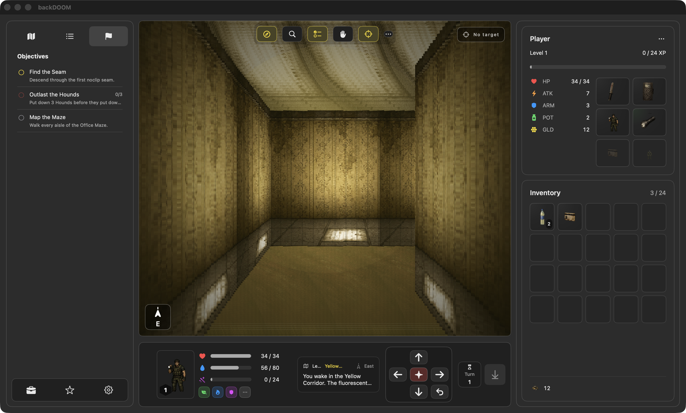

# backDOOM



_A live run in the Yellow Corridor, with objectives and target-lock overlays open in the first-person viewport._

backDOOM is a native SwiftUI first-person crawler for macOS and iOS — Backrooms lore in a DOOM-style shell, beginning in the buzzing yellow corridors of Level 1 and descending through the noclip seams toward levels nobody is meant to reach.

The current build includes:

- a raycast-style first-person viewport with a fluorescent flicker pass
- turn-based movement and combat against four entity classes
- procedural maze generation across five themed levels
- equipment, inventory, item pickups, Almond Water, and ranking up
- animated entity sprites and world-rendered item billboards (visible from a distance, scaled by depth)
- a native responsive shell with desktop sidebars, compact iPhone controls, panel sheets, immersive mode, minimap, HUD, and unified logging telemetry

## Levels

| # | Name | Mood |
|---|------|------|
| 1 | Yellow Corridor | Damp wallpaper, fluorescent buzz, no exits |
| 2 | Wet Carpet | Soaked maroon weave, distant footsteps |
| 3 | Office Maze | Beige cubicles in unreasonable geometry |
| 4 | Run For Your Life | Red emergency strip lighting. Something is keeping pace. |
| 5 | The End | The architecture is wrong on purpose |

## Entities

- **Smiler** — glowing teeth in the dark
- **Skin-Stealer** — wears the last wanderer's face
- **Agent** — suited intruder, fire-throwing
- **Hound** — quadrupedal stalker that hunts in the long corridors, hits like a freight train

## Requirements

- Xcode 26 or newer
- macOS 14 or newer for the generated macOS app target
- iOS 17 or newer for the generated iPhone/iPad app target
- XcodeGen for regenerating `backDOOM.xcodeproj`

## Run

Use the included script to build the SwiftPM macOS app bundle and launch it:

```bash
./script/build_and_run.sh
```

To verify that the built app launches:

```bash
./script/build_and_run.sh --verify
```

You can also build directly with SwiftPM:

```bash
swift build
```

To regenerate and build the Xcode app targets:

```bash
xcodegen generate
xcodebuild -project backDOOM.xcodeproj -scheme backDOOM_macOS -destination 'platform=macOS' build
xcodebuild -project backDOOM.xcodeproj -scheme backDOOM_iOS -destination 'generic/platform=iOS Simulator' build
```

Open `backDOOM.xcodeproj` in Xcode and select the `backDOOM_iOS` scheme to run on an iPhone or iPhone simulator. Select the `backDOOM_macOS` scheme for the macOS app target.

## Controls

- `Up Arrow`: step forward
- `Down Arrow`: step backward
- `Left Arrow`: pivot left
- `Right Arrow`: pivot right
- `Space`: strike
- `Command-N`: start a new run
- Bottom HUD buttons: drink Almond Water or descend through a noclip seam
- Phone/immersive toolbar: map, player, compass, examine, objectives, wait, target lock, and run menu

## Debugging And Telemetry

backDOOM uses Apple's unified logging APIs for runtime telemetry.

Stream game telemetry while the app is running:

```bash
./script/build_and_run.sh --telemetry
```

Stream process logs only:

```bash
./script/build_and_run.sh --logs
```

Launch under `lldb`:

```bash
./script/build_and_run.sh --debug
```

The app logs launch lifecycle, level generation, movement, combat, inventory actions, ranking, and seam transitions.

## Project Structure

- [`Sources/backDOOM/App`](Sources/backDOOM/App): app entry point and command menu
- [`Sources/backDOOM/Stores`](Sources/backDOOM/Stores): game state, procedural generation, combat, inventory, turn flow
- [`Sources/backDOOM/Models`](Sources/backDOOM/Models): level, player, entity, item, and animation models
- [`Sources/backDOOM/Views`](Sources/backDOOM/Views): viewport renderer, HUD, sidebars, minimap, sprite presentation
- [`Sources/backDOOM/Assets`](Sources/backDOOM/Assets): bundled textures, sprite atlases, entity animation sheets
- [`Resources/Assets.xcassets`](Resources/Assets.xcassets): app icon assets for the generated macOS and iOS app targets
- [`script`](script): build helper and asset-preparation scripts

## Generated Art And Assets

This project uses generated bitmap art as part of its prototype workflow.

Current notable assets:

Bundled (in-app) assets:

- [`Sources/backDOOM/Assets/level-texture-atlas.png`](Sources/backDOOM/Assets/level-texture-atlas.png): wall, floor, and ceiling textures used by the first-person renderer
- [`Sources/backDOOM/Assets/sprite-atlas.png`](Sources/backDOOM/Assets/sprite-atlas.png): shared sprites for survivor, entities, items, seams, and icons
- [`Sources/backDOOM/Assets/entity-idle-spritesheet.png`](Sources/backDOOM/Assets/entity-idle-spritesheet.png): repacked transparent entity idle animation sheet used in-game
- [`Sources/backDOOM/Assets/level-tileset.png`](Sources/backDOOM/Assets/level-tileset.png): retained reference tileset
- [`Resources/Assets.xcassets/AppIcon.appiconset`](Resources/Assets.xcassets/AppIcon.appiconset): iOS and macOS app icon renditions

Out-of-band art and screenshots:

- [`output/imagegen/backdoom-app-icon-source.png`](output/imagegen/backdoom-app-icon-source.png): simplified 1024×1024 source image used to generate the app icon set
- [`docs/screenshots/backdoom-app.png`](docs/screenshots/backdoom-app.png): current app screenshot
- [`output/imagegen/interface-concept.png`](output/imagegen/interface-concept.png): current backDOOM interface concept
- [`output/imagegen/backdoom-sprite-atlas-source.png`](output/imagegen/backdoom-sprite-atlas-source.png): raw source for the sprite atlas
- [`output/imagegen/backdoom-entity-idle-source.png`](output/imagegen/backdoom-entity-idle-source.png): raw source for the entity idle spritesheet
- [`output/imagegen/backdoom-level-texture-atlas-source.png`](output/imagegen/backdoom-level-texture-atlas-source.png): raw source for the level texture atlas
- [`output/imagegen/backdoom-hellbound-liminal-row-source.png`](output/imagegen/backdoom-hellbound-liminal-row-source.png): replacement source row for the Hound entity (legacy filename)
- [`output/imagegen/backdoom-hellspawn-liminal-row-source.png`](output/imagegen/backdoom-hellspawn-liminal-row-source.png): replacement source row for the Agent entity (legacy filename)

Asset support scripts:

- [`script/regenerate_floor_ceiling_textures.swift`](script/regenerate_floor_ceiling_textures.swift): regenerate the floor/ceiling tiles inside the level texture atlas
- [`script/generate_entity_idle_spritesheet.swift`](script/generate_entity_idle_spritesheet.swift): cut the in-game entity idle spritesheet from the shared sprite atlas
- [`script/prepare_entity_spritesheet.py`](script/prepare_entity_spritesheet.py): repack and clean a raw entity sheet into the bundled atlas layout
- [`script/prepare_level_tileset.py`](script/prepare_level_tileset.py): repack a 5×5 source grid into the 6×4 tileset reference
- [`script/replace_liminal_entity_rows.py`](script/replace_liminal_entity_rows.py): swap individual entity rows (Hound, Agent) in the bundled spritesheet from a row-source PNG

## Status

This is a playable prototype, not a finished game. The focus is the core crawl loop, native macOS presentation, and an asset pipeline built around generated images.

## License

backDOOM is released for **personal, non-commercial use only**. See [`LICENSE.md`](LICENSE.md) for the full terms and [`TERMS_OF_USE.md`](TERMS_OF_USE.md) for usage terms. App-store distribution and other commercial use are prohibited.
